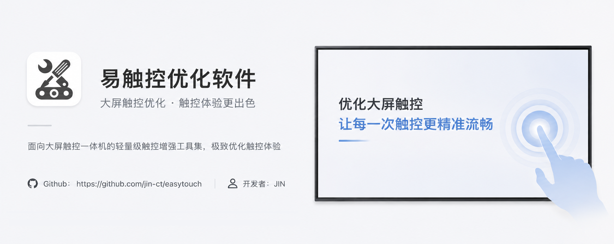

  

<h1 align="center">易触控优化软件</h1>

  面向大屏触控一体机的轻量级触控增强工具集

  
  
  
  

## 简介

`易触控工具栏` 是一款针对大屏触控一体机的优化软件，包含侧边工具栏以及多种触控优化组件。适用于**学校授课、会议室演讲**等场景，可有效改善大屏触控体验，提高大屏使用效率。  

项目基于 **Qt / Qt Quick** 构建。

## 安装与使用

- **支持系统**：Windows 10（64 位）及以上版本  
- **下载地址**：前往 [Release 页面](https://github.com/jin-ct/easytouch/releases) 获取最新安装包  
- **Tips**：任务栏托盘图标右键（或长按）可打开设置 

## 功能介绍

- ### 软件启动提示助手

  - **功能说明**：  
      当系统中有软件启动时（已过滤一些无关进程），显示一个弹窗，以提醒用户要耐心等待启动，防止重复启动软件。点击下方蓝色小字“忽略该进程”可将误判进程移入黑名单。

- ### 微信触控助手

  - **功能说明**：  
    微信 PC 版升级至 4.0 后尚未正式支持触控操作。微信触控助手通过覆盖透明窗口的方式，为微信增加触控支持，同时不影响鼠标操作；在触控屏环境下，仍可使用部分微信新功能（如框选等）。  
    可在软件设置中手动关闭该功能；将微信窗口**置顶时失效**（可用作临时关闭）。   

- ### 屏幕移位（屏幕局部实时镜像）

  - **功能说明**：  
    将屏幕中框选的局部区域进行**实时镜像**，显示到一个可移动、可缩放的独立窗口中，并支持保存镜像配置，便于下次快速开启。  

- ### 更多功能 (部分)

  - **关闭当前窗口**：模拟 `Alt + F4`，在大屏触控场景下更便捷地关闭窗口  
  - **系统音量调节**：在全屏播放 PPT / 视频时快速调节音量  
  - **屏幕批注**：支持在动态背景上进行批注  
  - **随机数生成**：可一次生成多个随机数，结果以卡片形式展示，并自动记住数值范围  
  - **U 盘辅助功能**：一键打开 / 弹出 U 盘；当 U 盘插入时发送“点击打开 U 盘”的系统通知

## 贡献与反馈

如果您有意向对易触控做出贡献，欢迎提交[拉取请求](https://github.com/jin-ct/easytouch/pulls)，
也欢迎通过[议题](https://github.com/jin-ct/easytouch/issues)提交 Bug 报告或功能请求。

由于我的开发时间有限，但有经常有一些不错的想法，如果您想为项目贡献一些新特性的代码但暂时没有想法时，欢迎到[QQ交流群](https://qm.qq.com/q/S66OzuSjM6)中与我交流。

#### 下面是构建项目和开发时的注意事项：
  - 构建项目的Qt版本不低于Qt6, 推荐开发时使用Qt6.8.3
  - 程序主入口为main.cpp, 加载UI时先加载Splash.qml，等配置文件读取完毕后再加载Main.qml

## Star History

<a href="https://www.star-history.com/?repos=jin-ct/easytouch&type=timeline&logscale=&legend=top-left">
 <picture>
   <source media="(prefers-color-scheme: dark)" srcset="https://api.star-history.com/chart?repos=jin-ct/easytouch&type=timeline&theme=dark&legend=top-left" />
   <source media="(prefers-color-scheme: light)" srcset="https://api.star-history.com/chart?repos=jin-ct/easytouch&type=timeline&legend=top-left" />
   
 </picture>
</a> 
