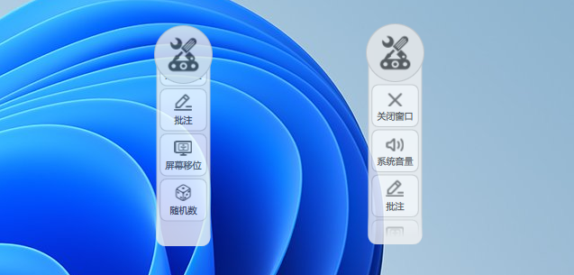
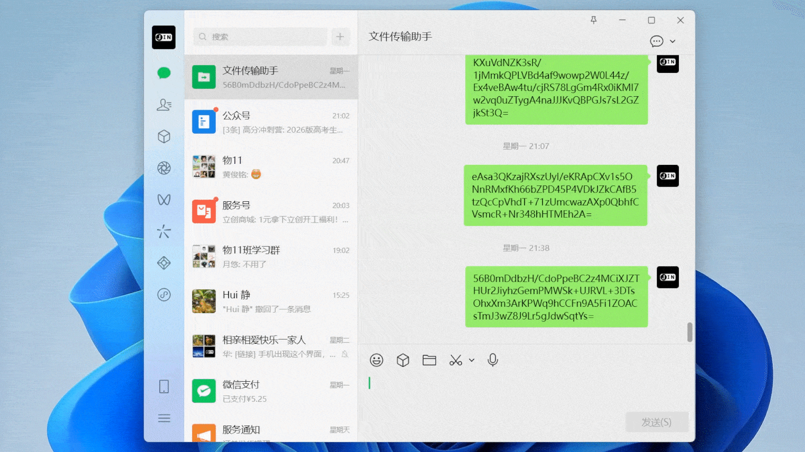
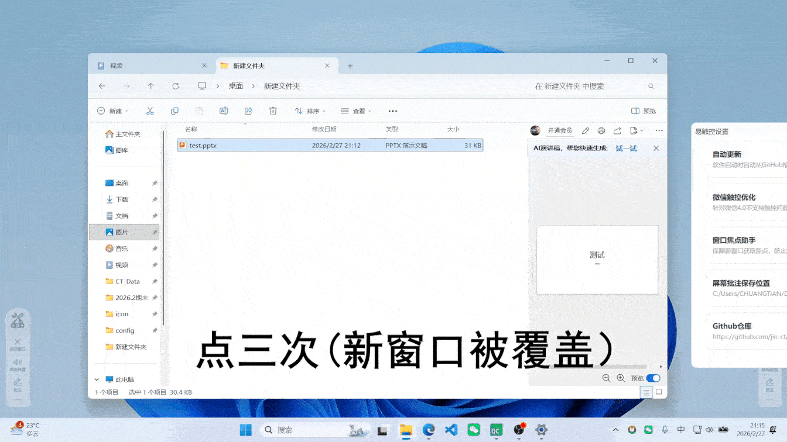
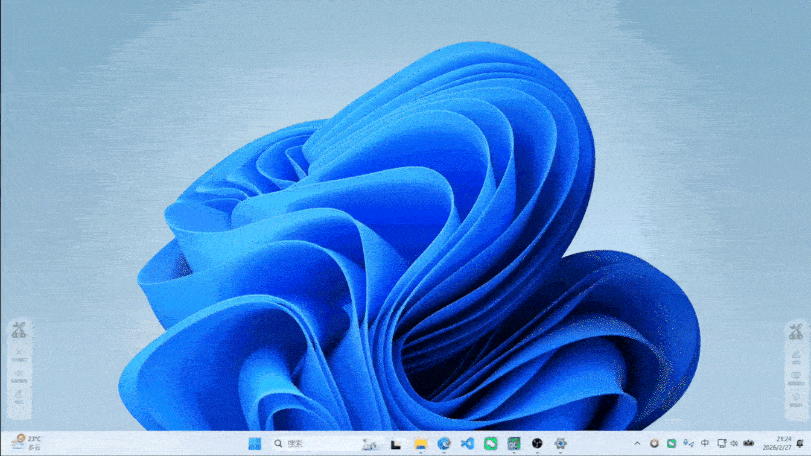

  

<h1 align="center">易触控工具栏</h1>

  面向 Windows 大屏触控一体机的轻量级触控增强工具集

---

## 简介

`易触控工具栏` 是一款针对 Windows 大屏触控一体机的优化软件，包含侧边工具栏以及多种触控优化组件。适用于**学校授课、会议室演讲**等场景，可有效改善 Windows 的触控体验，提高常用工具的使用效率。  

项目基于 **Qt / Qt Quick** 构建。

  

## 安装与使用

- **支持系统**：Windows 10（64 位）及以上版本  
- **下载地址**：前往 [Release 页面](https://github.com/jin-ct/easytouch/releases) 获取最新安装包  
- **Tips**：任务栏托盘图标右键可打开设置 

## 功能介绍

### 特色功能

- #### 微信触控助手

  - **功能说明**：  
    微信 PC 版升级至 4.0 后尚未正式支持触控操作。微信触控助手通过覆盖透明窗口的方式，为微信增加触控支持，同时不影响鼠标操作；在触控屏环境下，仍可使用部分微信新功能（如框选等）。  
    可在软件设置中手动关闭该功能；将微信窗口**置顶时失效**（可用作临时关闭）。  

  - **适用场景**：  
    - 希望在大屏触控设备上体验新版 PC 微信  
    - 避免在不知情的情况下因微信自动（或将来强制）更新而导致触控失效  

  

    
  

- #### 窗口焦点助手

  - **功能说明**：  
    确保新弹出的窗口能够正确获取焦点并成为活动窗口，解决在触控屏下由于系统响应迟缓，用户多次点击打开文件，导致**新打开窗口被其他窗口遮挡**的问题。  
    该功能可在设置中关闭。  

  - **适用场景**：  
    - 在触控大屏上使用文件资源管理器打开文件时，新窗口被最大化的资源管理器或其他窗口覆盖，而站在大屏前的操作者不易察觉  

  

    
  

- #### 屏幕移位（屏幕局部实时镜像）

  - **功能说明**：  
    将屏幕中框选的局部区域进行**实时镜像**，显示到一个可移动、可缩放的独立窗口中，并支持保存镜像配置，便于下次快速开启。  

  - **适用场景**：  
    - 播放视频、电影时，将字幕区域镜像到屏幕上方，方便教室后排同学观看  
    - 授课、演讲时，对屏幕局部内容进行放大展示  

  

    
  

### 其他功能

- **关闭当前窗口**：模拟 `Alt + F4`，在大屏触控场景下更便捷地关闭窗口  
- **系统音量调节**：在全屏播放 PPT / 视频时快速调节音量  
- **屏幕批注**：支持在动态背景上进行批注  
- **随机数生成**：可一次生成多个随机数，结果以卡片形式展示，并自动记住数值范围  
- **U 盘辅助功能**：一键打开 / 弹出 U 盘；当 U 盘插入时发送“点击打开 U 盘”的系统通知  

## 编译（Qt 版本）

- **开发环境支持版本**：Qt 6（MinGW）  
- **Release 构建版本**：Qt 6.5.3（MinGW，静态编译）  

